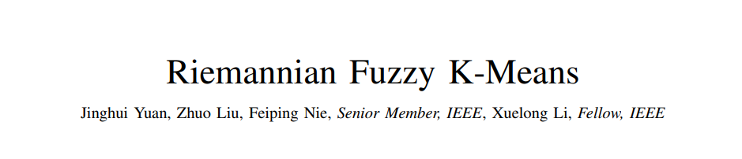
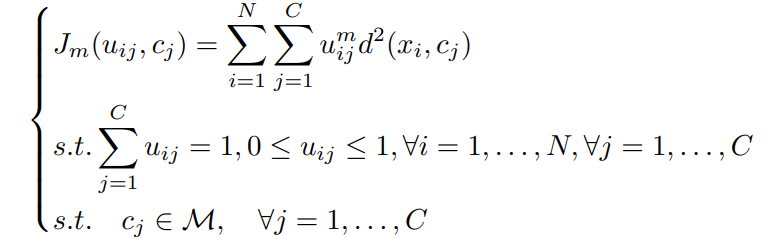
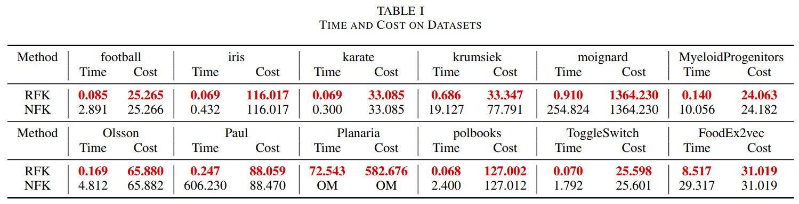
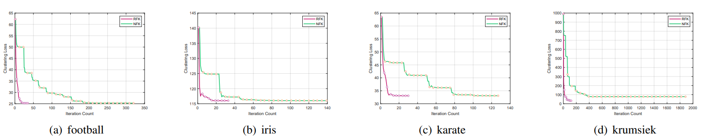
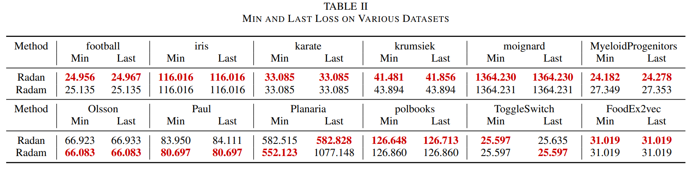
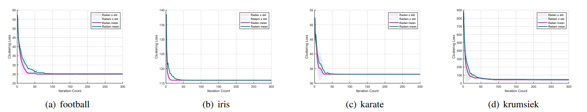

# Riemannian Fuzzy K-Means

<!-- Insert cover image here -->

<p align="center">
  
</p>
<p align="center">
  <a href="https://openreview.net/forum?id=9VmOgMN4Ie"></a>
    <a href="https://www.python.org/"></a>
  <a href="https://github.com/pchlenski/manify/tree/main"></a>
  <a href="https://opensource.org/licenses/MIT"></a>
</p>

Since **our algorithm has already been integrated into the non-Euclidean machine learning library Manify**, we will maintain our code [**<span style="color:red;">there</span>**](https://github.com/pchlenski/manify/tree/main).

## 📜 Introduction

This is the official implementation of our paper "[Riemannian Fuzzy K-Means](https://openreview.net/forum?id=9VmOgMN4Ie)" . In this paper, we propose two key algorithms: **Riemannian Fuzzy K-Means (RFK)** and the **Riemannian version of [Adan](https://github.com/sail-sg/Adan) (Radan)**, with rigorous proofs and extensive experimental validation.

> Clustering data on Riemannian manifolds, especially in hyperbolic spaces, has become an important problem in fields such as [bioinformatics](https://www.nature.com/articles/s41467-020-16822-4) and [natural language processing](https://ieeexplore.ieee.org/abstract/document/9658224). However, due to the complexity of Riemannian manifolds, how to perform fast and effective clustering on them has remained an open problem until now.

<p align="center">
  
</p>

> Existing [Riemannian K-Means algorithms](https://geomstats.github.io/api/geomstats.learning.html#geomstats.learning.kmeans.RiemannianKMeans) require iterative updates of cluster centers and assignments. Since the cluster centers lie on a Riemannian manifold, each update involves solving a Riemannian optimization problem to handle the manifold constraints. The repeated Riemannian optimizations result in an **unacceptable computational complexity**.

One of our contributions is the proposal of the Riemannian Fuzzy K-Means algorithm, which reduces the O(N) times Riemannian optimizations required by the Riemannian K-Means algorithm to **<span style="color:red;">just a single one</span>**. This makes large-scale clustering on manifolds feasible.

Another contribution is the extension of the well-known [Adan](https://github.com/sail-sg/Adan) algorithm to Riemannian manifolds (Radan) using techniques from Riemannian geometry, enabling it to operate on manifolds and further accelerating optimization with the Nesterov momentum method.

## 🔑 Key Features and Contributions

- **Significant Theoretical Acceleration:** Our work provides a substantial theoretical speedup for clustering algorithms on Riemannian manifolds, reducing the number of Riemannian optimizations in K-Means-type algorithms **<span style="color:red;">from $\mathcal{O}(N)$ to 1</span>**.
- **Riemannian Adaptive Nesterov Momentum Algorithm:** We extend Adan to Riemannian manifolds and propose the Radan optimizer. To the best of our knowledge, this is  <span style="color:red;">**the first**</span>  adaptive optimization method on Riemannian manifolds that leverages Nesterov acceleration, contributing to the development of faster optimizers on manifolds.
- **Complete theory:** We provide complete proofs, including the computation of the Riemannian gradient and the convergence proof of Radan.
- **Efficiency of the algorithm:** We conducted extensive experiments showing that Riemannian Fuzzy K-Means achieves the best performance while requiring the least amount of time. Additionally, Radan outperforms the Riemannian version of Adam (Radam).
- **Provide <span style="color:red;">new insights</span>:** We point out that on Riemannian manifolds, Fuzzy K-Means can be used to <span style="color:red;">**completely replace**</span> K-Means for clustering.

## 🏆 Acceptance and Publication

- 🔥 (2025-05-30) **Riemannian Fuzzy K-Means** has been integrated into [Manify]((https://github.com/pchlenski/manify/tree/main)) — a non-Euclidean machine learning library developed at Columbia University.
- 🔥 (2025-05-30) **Riemannian version of Adan (Radan)** has been integrated into [Manify]((https://github.com/pchlenski/manify/tree/main)).
- 🔥 (2025-06-08) **Riemannian version of Adan (Radan)** has been listed as a [Supported Project](https://github.com/sail-sg/Adan?tab=readme-ov-file#supported-projects) on the official [Adan](https://github.com/sail-sg/Adan) homepage maintained by Sea AI Lab, Singapore.
- Please stay tuned for further updates ……
- If you would like to include these algorithms in a library you maintain, please feel free to contact me.

## 📊 Performance Highlights

Compared to Riemannian K-Means, Riemannian Fuzzy K-Means is significantly faster — on moderately larger datasets, **it can achieve speedups of over 100×**.

<p align="center">
  
</p>

The convergence curves also reflect this difference. Algorithms that separately update cluster centers and assignments exhibit a loss curve with continuous Riemannian optimization segments for center updates, interleaved with noticeable steps during assignment updates. In contrast, **Riemannian Fuzzy K-Means performs all updates in a single Riemannian optimization**, resulting in a smooth and continuous loss curve.

<p align="center">
  
</p>

The table below demonstrates the acceleration effect of Radan compared to Radam. As shown, **Radan outperforms Radam in most cases**.

<p align="center">
  
</p>


It can also be observed that Radan's convergence curves **consistently reach convergence earlier** than those of Radam.

<p align="center">
  
</p>

We selected 12 baseline algorithms across 11 datasets, and on 5 different evaluation metrics, our methods frequently **achieve state-of-the-art performance**.

For additional information, including images and tables,**<span style="color:red;">  please refer to the [paper](https://openreview.net/forum?id=9VmOgMN4Ie).</span>** 


## 💻 Repository Contents

Since **our algorithm has already been integrated into the non-Euclidean machine learning library Manify**, we will maintain our code [**<span style="color:red;">there</span>**](https://github.com/pchlenski/manify/tree/main).

Our code can be found in the clustering and optimizers folders of [Manify]((https://github.com/pchlenski/manify/tree/main)), with the core files being [fuzzy_kmeans.py](https://github.com/pchlenski/manify/blob/main/manify/clustering/fuzzy_kmeans.py) and [radan.py](https://github.com/pchlenski/manify/blob/main/manify/optimizers/radan.py).

## ⚙️ Installation

- **Download Manify:** Please download [Manify]((https://github.com/pchlenski/manify/tree/main)) as follows.

```bash
# Clone the repository
git clone https://github.com/pchlenski/manify.git
```

- **Run the code!** : I’ve written a simple demo called **64_start_clustering**, which you can find [here](https://github.com/pchlenski/manify/blob/main/notebooks/64_start_clustering.ipynb). It includes a straightforward function call example—**just run it!** 
- If you have any other questions or want to apply Riemannian Fuzzy K-Means to your specific task, **feel free to contact me**.

## ❤ Citation

If you find our work useful in your research, please consider citing:

```bibtex
@article{Yuan2025,
  title={Riemannian Fuzzy K-Means},
  author={Anonymous},
  journal={OpenReview},
  year={2025},
  url={https://openreview.net/forum?id=9VmOgMN4Ie}
}
```

Or please consider citing the GitHub homepage.

```bibtex
@misc{Yuan2025RiemannianFuzzyKMeans,
  author       = {Jinghui Yuan},
  title        = {Riemannian-Fuzzy-K-Means},
  howpublished = {\url{https://github.com/Yuan-Jinghui/Riemannian-Fuzzy-K-Means}},
  year         = {2025},
  note         = {GitHub repository}
}
```

## ✨Acknowledgements

Our code is based on [Geoopt](https://github.com/geoopt/geoopt); we would like to thank the authors of this open-source Python library for Riemannian optimization. We also express our gratitude to the [Manify](https://github.com/pchlenski/manify) development team for designing an open and unified code framework. Additionally, we thank the authors of [Adan](https://github.com/sail-sg/Adan), whose highly effective optimizer serves as the foundation for our Radan algorithm.

## 📝 License

This project is licensed under the MIT License - see the [LICENSE](LICENSE) file for details.

---

<p align="center">
  <i>For questions and inquiries about this research, please refer to the contact information in the paper.</i>
</p>
